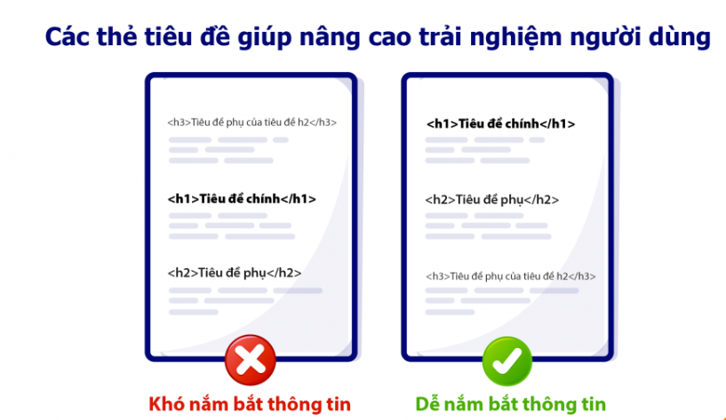

# Các thẻ tiêu đề

* Trong HTML có 6 thẻ tiêu đề từ h1 - h6. Con số trong tên thẻ thể hiện cấp độ (Level) của thẻ, cấp độ ở đây là việc ưu tiên thứ tự sử dụng thẻ. Trong đó cấp 1 là ưu tiên cao nhất, cấp 6 là ưu tiên thấp nhất.

## 3.1 Thẻ tiêu đề ```<h1>```

* Thẻ ```<h1>``` được sử dụng làm tiêu đề chính cho trang web. Đây là phần tiêu đề nổi bật nhất, dễ thấy nhất, mang thông điệp ngắn gọn giúp người dùng và công cụ tìm kiếm hiểu trang web của bạn nói về điều gì.

### Giúp công cụ tìm kiếm hiểu nội dung trang web
* thẻ ```<h1>``` giúp Google hiểu cấu trúc & nội dung của một trang web. Vì vậy, bạn nên sử dụng thẻ ```<h1>``` cho tiêu đề chính cho trang web của bạn nhé.

### Nâng cao trải nghiệm người dùng
* Trong nhiều trường hợp, thẻ ```<h1>``` là một phần trong cấu trúc phân cấp của trang web. Trong đó thẻ ```<h1>``` là tiêu đề nổi bật nhất, sau đó là: ```<h2>```, ```h3```, …



### Nâng cao khả năng tiếp cận
* Khả năng tiếp cận cho trang web (Web accessibility) đề cập đến việc thiết kế các trang web đáp ứng cho mọi người
 * Theo nghiên cứu của webAIM, 60% người dùng trình đọc màn hình thích tiêu đề trang web là 1 thẻ ```<h1>```.


## 3.2 Thẻ tiêu đề ```<h2>```

* Thẻ ```<h2>``` được sử dụng làm tiêu đề các phần chính trong một trang web. Thẻ ```<h2>``` được sử dụng làm tiêu đề con của thẻ ```<h1>```.

* Ví dụ:
```
<h1>Lộ trình học</h1>
<h2>Lộ trình học Frontend</h2>
<h2>Lộ trình học Backend</h2>
```

* Lưu ý, thẻ ```<h2>``` được dùng làm tiêu đề con của thẻ ```<h1>``` ở đây nghĩa là về mặt trình bày và ý nghĩa sử dụng, không phải đề cập tới việc đưa thẻ ```<h2>``` vào bên trong thẻ <h1>.

* Ví dụ sử dụng sai:
```
<h1>
    Lộ trình học
    <h2>Lộ trình học Frontend</h2>
    <h2>Lộ trình học Backend</h2>
</h1>
```
* Chúng ta sẽ không lồng các thẻ h vào nhau khi sử dụng.

## 3.3 Thẻ h3-h6

* Thẻ tiêu đề h3 - h6
  - Thẻ ```<h3>``` là tiêu đề con của thẻ ```<h2>```
  - Thẻ ```<h4>``` là tiêu đề con của thẻ ```<h3>```
  - Thẻ ```<h5>``` là tiêu đề con của thẻ ```<h4>```
  - Thẻ ```<h6>``` là tiêu đề con của thẻ ```<h5>```
* Tránh bỏ qua các cấp độ
  - Khi sử dụng các thẻ `h`, bạn nên tránh bỏ qua các cấp độ tiêu đề. Nếu bạn đang sử dụng thẻ `h1`, thì sau đó nên là thẻ `h2`. Tránh bỏ qua thẻ `h2` mà đi tới luôn thẻ `h3`. Tương tự như vậy cho tới thẻ `h6`.
---
---
---