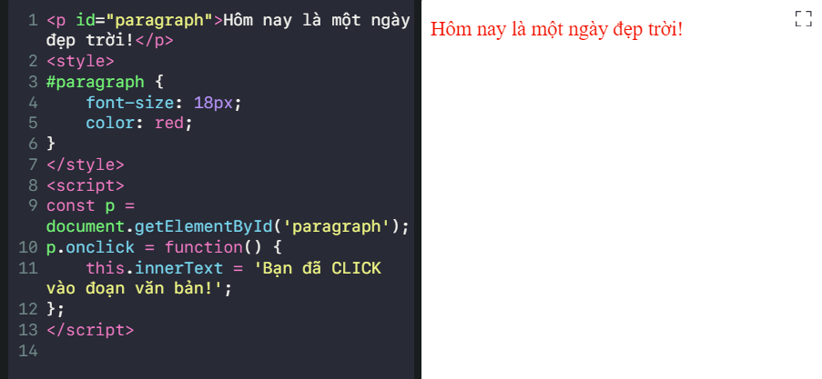

# 2. Làm quen HTML
---
## 2.1 Vai trò của HTML, CSS và JavaScript

* **_HTML_** (HyperText Markup Language - Ngôn ngữ đánh dấu siêu văn bản), CSS (Cascading Style Sheets - Các tập tin định kiểu theo tầng) và JavaScript là 3 ngôn ngữ để phát triển web mà trình duyệt có thể hiểu. Chúng là các ngôn ngữ khác nhau nhưng có quan hệ mật thiết với nhau, mỗi ngôn ngữ được thiết kế cho những nhiệm vụ cụ thể. Việc hiểu rõ được cách chúng làm việc với nhau sẽ giúp bạn sớm trở thành một nhà phát triển web chuyên nghiệp.

Trước tiên, bạn cần nắm được:

* `HTML` dùng để thêm ý nghĩa cho nội dung bằng cách đánh dấu nó
* `CSS` dùng để định dạng cho nội dung đã được đánh dấu bởi HTML
* `JavaScript` dùng để thêm chức năng giúp người dùng có thể tương tác nhiều hơn với trang web

_HTML là phần cấu trúc, CSS hoàn thiện về thẩm mỹ, JavaScript làm tính năng tương tác._

Ví dụ: bạn có thể đánh dấu một đoạn văn bản với code HTML như này:

```
<p id="paragraph">Hôm nay là một ngày đẹp trời!</p>
```

Sau đó, bạn có thể đặt kích thước và màu sắc cho đoạn văn bản với CSS sau:

```
#paragraph {
    font-size: 18px;
    color: 
red;
}
```

Cuối cùng, nếu bạn muốn nhấn vào đoạn văn bản thì nội dung của nó sẽ thay đổi, thêm code JavaScript sau:

```
const p = document.getElementById('paragraph');
p.onclick = function() {
    this.innerText = 'Bạn đã CLICK vào đoạn văn bản!';
};
```



---

## 2.2 Chi tiết về ngôn ngữ HTML

* HTML là ngôn ngữ đánh dấu siêu văn bản (HyperText Markup Language)
* HTML là ngôn ngữ đánh dấu, HTML không phải là một ngôn ngữ lập trình
* Siêu văn bản (hypertext) là loại văn bản chứa nhiều loại dữ liệu khác nhau như: văn bản, âm thanh, hình ảnh, video, … và các siêu liên kết
* Cú pháp cơ bản của HTML bao gồm thẻ mở và thẻ đóng. Ví dụ: Hôm nay là <i>một ngày đẹp trời!</i> thì <i> là thẻ mở, </i> là thẻ đóng.

---

## 2.3 Cấu trúc tiêu chuẩn của file HTML

* Mỗi file HTML có đuôi mở rộng là html, ví dụ: index.html. Cấu trúc gồm 4 phần: DOCTYPE, <html>, <head> và <body>
DOCTYPE là dòng đầu tiên cần được khai báo trong mọi file HTML.
* Thẻ <html> chứa toàn bộ nội dung của trang web.
* Thẻ <head> chứa các thẻ meta, thẻ <body> chứa nội dung được hiển thị của trang web.
* Thuộc tính lang sử dụng để chỉ định ngôn ngữ của trang web. Các công cụ dịch ngôn ngữ và trình đọc màn hình sẽ sử dụng thuộc tính này.

---

## 2.4 Tìm hiểu về các thẻ meta

* Thẻ meta được sử dụng để cung cấp thêm thông tin và dữ liệu cho trang web. Các thẻ meta thường được sử dụng bởi trình duyệt, các công cụ tìm kiếm và trình thu thập dữ liệu của các mạng xã hội.
* Thẻ meta là một trong số thẻ tự đóng (self-closing tag), nhờ vậy không cần thêm thẻ đóng khi sử dụng thẻ meta.

    **1. Thẻ meta charset**
    - Thẻ meta với charset="UTF-8" có tác dụng hỗ trợ hiển thị các ký tự nằm ngoài khoảng từ A - Z. Ví dụ: tiếng Việt có dấu, tiếng Trung, tiếng Nhật, riếng Ả Rập, …

    - Nếu bạn không khai báo meta charset tại vị trí đầu tiên trong thẻ <head> thì trong một số trường hợp nội dung trang web chứa ký tự phức tạp, trình duyệt sẽ cố gắng đoán bảng mã ký tự và có thể gây ra lỗi hiển thị không mong muốn.
    
    **2.Thẻ meta title**
    - Tuy thẻ này không có từ meta nhưng vẫn nằm trong nhóm thẻ meta. Đây là thẻ chứa tiêu đề của trang web, tiêu đề này được sử dụng trong một số trường hợp:

        - Hiển thị tiêu đề trang web trên thanh tab của trình duyệt
        - Hiển thị tiêu đề trong kết quả của công cụ tìm kiếm (ví dụ: Google Search)
        
    **3.Thẻ meta viewport**
    - Để tối ưu hóa việc hiển thị giao diện web trên nhiều thiết bị có kích cỡ màn hình khác nhau (như PC, tablet, mobile) bạn sẽ cần sử dụng thẻ meta viewport.
    - Nếu trang web của bạn không có thẻ meta viewport thì khi mở trên thiết bị di động nội dung sẽ bị thu nhỏ, bạn phải phóng to để dễ dàng đọc được. Các trang web được xây dựng vào khoảng những năm 2010 thường gặp vấn đề này.
    - Trong thẻ meta viewport, giá trị width=device-width nhằm yêu cầu trình duyệt đặt chiều rộng của trang web bằng chiều rộng của thiết bị (PC, tablet, mobile). Giá trị initial-scale=1.0 nhằm giữ đúng kích thước/tỉ lệ mặc định của trang web.
    
    **4.Thẻ meta Open Graph**
    - Đây là các thẻ meta được trình thu thập nội dung của Facebook sử dụng, nhằm lấy thông tin của trang web phục vụ việc hiển thị khi trang web được chia sẻ trên mạng xã hội này.
---

## 2.5 Boilerplate là gì và cách sử dụng
* Boilerplate được coi là những đoạn code được tiêu chuẩn hóa và tái sử dụng ở nhiều nơi mà ít khi có sự thay đổi
* Có thể tạo nhanh cấu trúc HTML cơ bản bằng cách gõ ! và sau đó nhấn phím Tab (được hỗ trợ bởi Emmet)

## 2.6 Các thẻ html thông dụng
* Thẻ h1, h2
    - Trong HTML có 6 thẻ được dùng để làm tiêu đề từ thẻ h1 - h6. Trong đó chữ h được viết tắt của từ heading (ý nghĩa: tiêu đề, phần mở đầu). Trong bài này, mình giới thiệu trước cho các bạn 2 thẻ là ```<h1>``` và ```<h2>``` vì đây là 2 thẻ được sử dụng phổ biến nhất trong số các thẻ tiêu đề.
    - Cách sử dụng:
    ```
    <h1>Nội dung làm tiêu đề chính</h1>
    <h2>Nội dung làm tiêu đề phụ</h2>
    ```

* Thẻ p
    - Thẻ <p> để thể hiện các đoạn văn, p là viết tắt của paragraph (ý nghĩa: đoạn văn bản). Thẻ <p> được sử dụng để thể hiện các đoạn văn bản trong nội dung bài viết như: mô tả bài blog, các đoạn văn bản trong bài blog, các đoạn văn bản trong nội dung sản phẩm, nội dung các bình luận trên mạng xã hội, …

   - Cách sử dụng:
    ```
    <p>Đoạn văn 1</p>
    <p>Đoạn văn 2</p>
    ```

* Thẻ b, i, u
    - Đây là 3 thẻ có chức năng khá quen thuộc nếu các bạn đã sử dụng các trình soạn thảo văn bản. Trong đó b viết tắt của bold (ý nghĩa: in đậm), i viết tắt của italic (ý nghĩa: in nghiêng) và u viết tắt của underline (ý nghĩa: gạch chân).
    - Cách sử dụng:
    ```
    <b>Đoạn văn được in đậm</b>
    <i>Đoạn văn được in nghiêng</i>
    <u>Đoạn văn được gạch chân</u>
    ```
* Thẻ a
    - Khi truy cập các trang web bạn gần như luôn bắt gặp các thẻ a, thẻ này giúp tạo ra một siêu liên kết tới các trang web, các file, email, … Trong đó, a viết tắt của anchor (ý nghĩa: điểm neo, neo một liên kết).
    - Cách sử dụng:
    ```
    <a href="liên kết">Đoạn văn bản có thể nhấn</a>
    ```
* Thẻ img
    - Đây là thẻ dùng để hiển thị hình ảnh trên trang web. Trong đó img viết tắt của image (ý nghĩa: hình ảnh). Trong một trang web, hình ảnh được sử dụng rất phổ biến: logo trang web, ảnh đại diện, ảnh bìa, hình ảnh các mặt hàng trên trang web TMDT, …
    - Cách sử dụng:
    ```
    
    ```
* Thẻ ul, li
    - Thẻ ul và li được sử dụng để tạo giao diện dạng danh sách, 2 thẻ này được sử dụng rất phổ biến trong nội dung các bài viết.
    - Trong đó, ul viết tắt của unordered list (ý nghĩa: danh sách không có thứ tự) và li viết tắt của list item (ý nghĩa: mục trong danh sách).
    - Cách sử dụng:
    ```
    <ul>
        <li>Nội dung 1</li>
        <li>Nội dung 2</li>
        <li>Nội dung 3</li>
    </ul>
    ```
* Thẻ ol, li
    - Gần giống như cặp thẻ ul, li. Đây cũng là 2 thẻ để tạo giao diện danh sách. Điểm khác biệt duy nhất nằm ở ol, ol viết tắt của ordered list (ý nghĩa: danh sách có số thứ tự). Sử dụng thẻ này trong trường hợp bạn muốn thể hiện rõ số thứ tự của các mục trong danh sách.
    - Cách sử dụng:
    ```
    <ol>
        <li>Nội dung 1</li>
        <li>Nội dung 2</li>
        <li>Nội dung 3</li>
    </ol>
    ```

---
## 2.7 Tìm hiểu về thuộc tính trong HTML
* Thuộc tính là gì?
  - Thuộc tính (attribute) được sử dụng để bổ sung thêm thông tin và dữ liệu cho các thẻ HTML.Các thuộc tính có dạng ```key="value"``` và luôn được viết trong thẻ mở của các thẻ HTML (không bao giờ được viết trong thẻ đóng).
  - Thuộc tính ```lang``` trong thẻ ```<html>```
  ```
  <html lang="vi">
    ...
    </html>
  ```
    - Ví dụ trên có 1 thuộc tính là lang="vi", nó gồm 2 thành phần:
    1.lang
    2.vi
    - Trong đó, lang được gọi là khóa của thuộc tính, vi được gọi là giá trị của thuộc tính.

   - Thuộc tính ```charset``` trong thẻ ```meta```:
     ```
        <meta charset="UTF-8" />
     ```
   - Thuộc tính ```href``` trong thẻ ```<a>```:
     ```
     <a href="https://fullstack.edu.vn/">Tới trang web F8</a>
     ```
   - Thuộc tính ```src``` trong thẻ ``````:
     ```
     
     ```
* Nhiều thuộc tính
  - Bạn có thể sử dụng đồng thời nhiều thuộc tính trong một thẻ HTML, mỗi thuộc tính (mỗi cặp ```key="value"```) được cách nhau bởi một khoảng trắng.

   - Thuộc tính name và content trong thẻ ```<meta>``` viewport:
   ```
    <meta name="viewport" content="width=device-width, initial-scale=1.0" />
    ```
   - Trong ví dụ trên có 2 thuộc tính là:

        - name="viewport"
        - content="width=device-width, initial-scale=1.0"
   - Trong thuộc tính thứ nhất có:

        - key: name
        - value: viewport
   - Trong thuộc tính thứ hai có:
        - key: content
        - value: width=device-width, initial-scale=1.0
* Thuộc tính toàn cục
  - Các thuộc tính được đề cập trong phần này có thể sử dụng cho toàn bộ các thẻ HTML. Vì vậy, chúng được gọi là thuộc tính toàn cục (Global Attributes).
  - Thuộc tính lang
    Mặc định thuộc tính lang không được sử dụng cho trang web. Khi bạn sử dụng thuộc tính này cho thẻ ```<html>``` thì mặc định các thẻ trong trang web sẽ thừa kế lại thuộc tính lang này.
  - Ví dụ:
    ```
    <html lang="vi">
        ...
    <body>
        <!-- Các thẻ p này cũng sẽ có lang="vi" -->
        <p>Hôm nay là một ngày đẹp trời</p>
        <p>Hôm qua cũng là một ngày đẹp trời</p>
    </body>
    </html>
    ```
  - Thuộc tính hidden
    - Các thẻ HTML có thuộc tính hidden sẽ được ẩn khỏi giao diện trang web (bao gồm cả các thẻ con và nội dung của nó).
    ```
    <p>Hôm nay là một ngày đẹp trời!</p>
    <p hidden>Hôm qua cũng là một ngày đẹp trời!</p>
    ```
  - Thuộc tính title
    - Đây là thuộc tính bổ sung thông tin cho một thẻ HTML, nội dung của thuộc tính này sẽ hiển thị khi bạn đưa con trỏ chuột vào phần nội dung của nó.
---

## 2.8 Các mẹo để viết HTML tốt hơn
* Luôn viết cú pháp mở và đóng thẻ trước, sau đó mới viết nội dung
* Sử dụng thụt lề bằng 1 dấu Tab cho các thẻ con
* Không viết dư thừa các khoảng trắng và các dấu ngắt dòng
* Sử dụng dấu ngắt dòng hợp lý, đảm bảo code dễ đọc
* Đặt các thẻ đúng vị trí. Ví dụ: thẻ ```<li>``` luôn là con trực tiếp của thẻ ```<ul>```, ```<ol>```
* Luôn nhớ sử dụng https cho các URL trong thuộc tính ```href```